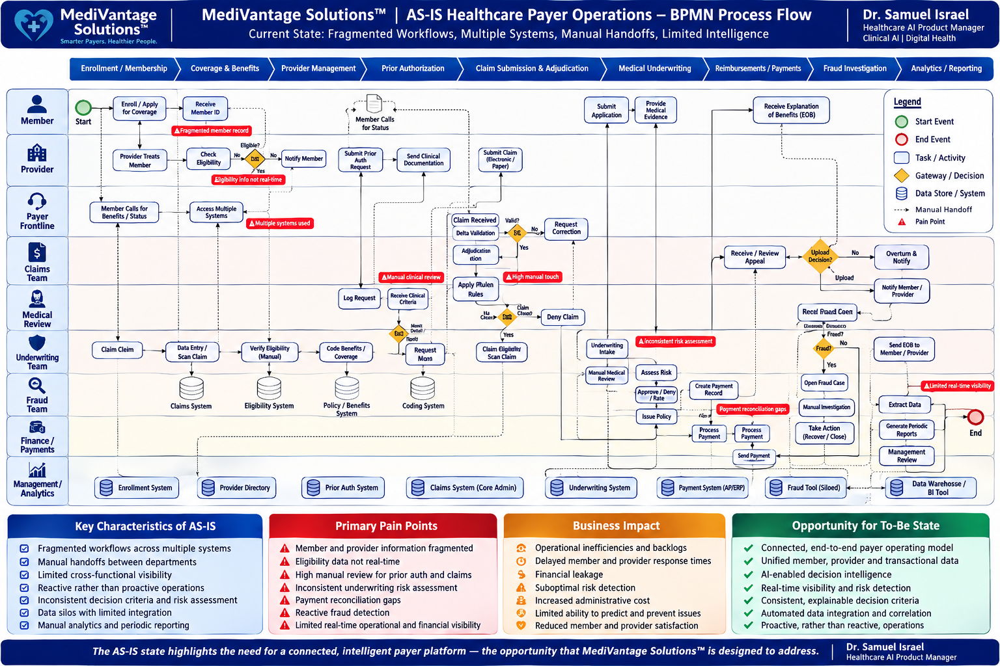
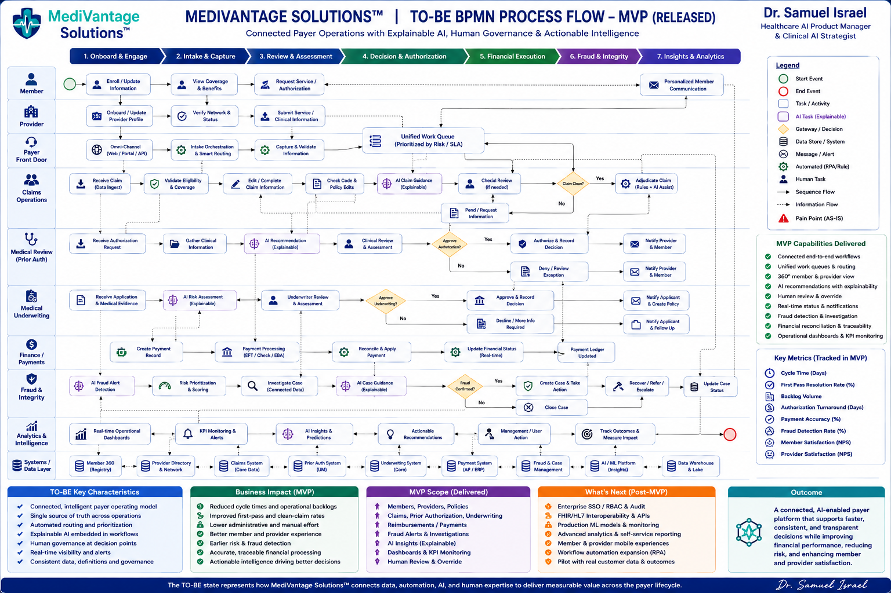

# MediVantage Solutions™

## AI-Enabled Healthcare Payer Operations & Decision Intelligence Platform


> **Connected Healthcare Payer Operations. Explainable Intelligence. Human-Governed Decisions.**

MediVantage Solutions™ is a healthcare payer operations and decision-intelligence platform designed to connect fragmented clinical, administrative, financial, and risk-management workflows within a unified operating environment.

The released MVP demonstrates how payer organizations can progress from fragmented transactional workflows toward:

**Connected Data → Connected Workflow → Risk & Intelligence → Explainable Recommendation → Human Review → Decision → Action**

---

## 🚀 Live MVP Demo

### [Launch MediVantage Solutions™](https://medivantage-frontend.onrender.com)


> The deployed application is an MVP demonstration environment using synthetic healthcare payer data. It is not intended for processing real PHI/PII or production healthcare decisions.

---

## 1. Product Overview

Healthcare payer operations frequently span multiple systems and teams responsible for member management, provider operations, claims, prior authorization, medical underwriting, reimbursements, fraud investigation, and analytics.

MediVantage Solutions™ demonstrates how these workflows can be connected while introducing AI-assisted decision support at appropriate points in the payer lifecycle.


## AS-IS Healthcare Payer Operations – BPMN Process Flow

The AS-IS model illustrates the fragmented current-state payer operating environment, including manual handoffs, siloed systems, high manual review, reconciliation gaps, reactive fraud detection, and limited real-time visibility.



---

## TO-BE MediVantage MVP – BPMN Process Flow

The TO-BE model represents the released MediVantage Solutions™ MVP operating model, connecting payer workflows through structured data, AI-assisted intelligence, explainable recommendations, human governance, financial traceability, fraud investigation, and operational analytics.



### MVP Capabilities

- Members & Enrollments
- Providers
- Policies
- Claims
- Prior Authorization
- Medical Underwriting
- Reimbursements
- Fraud Investigation
- Analytics
- AI Insights
- Human Review & Decision Support

---

## 2. Business Problem

Healthcare payer teams may need to navigate multiple systems and manually reconstruct information before making operational, clinical, or financial decisions.

Common challenges include:

- Fragmented member and provider information
- Manual handoffs between departments
- High manual review workload
- Limited cross-functional visibility
- Claims and authorization backlogs
- Inconsistent risk assessment
- Payment reconciliation gaps
- Reactive fraud detection
- Limited real-time operational intelligence
- Disconnected analytics and decision-making

MediVantage explores a future-state operating model where these activities can be managed within a connected payer environment.

---

## 3. Product Vision

> **Create an intelligent healthcare payer operating environment where clinical, administrative, financial, and risk information works together to support faster, more consistent, explainable, and accountable decisions.**

The product is designed around five principles:

**CONNECT** — Bring relevant payer information and workflows together.

**UNDERSTAND** — Give users contextual information at the point of decision.

**PREDICT** — Surface emerging operational, financial, and risk signals.

**ACT** — Convert intelligence into actionable workflow recommendations.

**GOVERN** — Maintain appropriate human oversight and decision traceability.

---

## 4. Product Operating Model

```text
Healthcare Data
      │
      ▼
Connected Payer Workflow
      │
      ▼
Risk / Intelligence
      │
      ▼
Explanation & Evidence
      │
      ▼
Recommendation
      │
      ▼
Human Review
      │
      ▼
Decision
      │
      ▼
Operational Action
      │
      ▼
Outcome

----
Core Product Principle

AI should support the healthcare decision workflow—not become the workflow.

5. Business Process Transformation

MediVantage Solutions™ was designed using formal AS-IS and TO-BE payer workflow analysis to connect product development directly to identified operational problems.

AS-IS Healthcare Payer Operations

The AS-IS model represents a fragmented payer operating environment characterized by multiple systems, manual handoffs, high manual review, inconsistent risk assessment, payment reconciliation gaps, reactive fraud detection, and limited real-time operational intelligence.

TO-BE MediVantage MVP Operating Model

The TO-BE model represents the operating model delivered through the released MediVantage MVP.

It connects payer workflows through structured data, unified operational context, AI-assisted intelligence, explainable recommendations, human governance, financial traceability, fraud investigation, and operational analytics.

## Process Flow Diagrams


Transformation

Fragmented & Manual

↓

Connected & Contextual

↓

Intelligent & Explainable

↓

Human-Governed & Actionable

----
| Module               | Capability                                    |
| -------------------- | --------------------------------------------- |
| Members              | Member registry and payer context             |
| Enrollments          | Coverage and health-plan relationships        |
| Providers            | Provider registry and operational context     |
| Policies             | Policy and coverage information               |
| Claims               | Claims management and Claim 360               |
| Prior Authorization  | Clinical authorization review                 |
| Medical Underwriting | Medical risk assessment and decision workflow |
| Reimbursements       | Payment and reconciliation lifecycle          |
| Fraud                | Fraud alerts and investigation workflows      |
| Analytics            | Operational and financial intelligence        |
| AI Insights          | Explainable AI-assisted recommendations       |

----

7. Claims Management

Claims provides a major transactional foundation for the platform.

The Claim 360 experience brings together:

Claim information
Member context
Provider context
Service information
Financial adjudication
Status information
Risk indicators
Related operational intelligence
----

Target Workflow:

Claim Intake
    ↓
Validation
    ↓
Coverage / Eligibility
    ↓
Rules / Policy Review
    ↓
Clinical Review Where Required
    ↓
Adjudication
    ↓
Decision
    ↓
Financial Outcome

----

8. Prior Authorization

The Prior Authorization capability supports structured clinical review.

Authorization Request
        ↓
Clinical Information
        ↓
Coverage / Rules
        ↓
Assessment
        ↓
AI-Assisted Recommendation
        ↓
Human Clinical Review
        ↓
Authorization Decision
        ↓
Notification

Decision support and final clinical decision remain distinct.

----
9. Medical Underwriting

Medical Underwriting demonstrates how AI-assisted risk assessment can be integrated into a governed insurance workflow.

Application
     ↓
Medical Evidence
     ↓
AI Assessment
     ↓
Risk
     ↓
Rules
     ↓
Recommendation
     ↓
Human Review
     ↓
Decision
     ↓
Audit
The system is designed to support the underwriter rather than autonomously replace professional judgment.

----
10. Reimbursements & Payments

The reimbursement capability provides traceability across the financial lifecycle.

Claim
  ↓
Approved Amount
  ↓
Reimbursement
  ↓
Payment
  ↓
Reconciliation

This creates a foundation for future payment-integrity capabilities including exception monitoring and duplicate-payment detection.

----
11. Fraud & Integrity

Fraud functionality is structured as an investigation workflow rather than simply displaying risk scores.

Detection
   ↓
Alert
   ↓
Risk Prioritization
   ↓
Investigation
   ↓
Supporting Evidence
   ↓
Human Review
   ↓
Action
   ↓
Case Resolution

Investigators can use connected claim, provider, financial, and risk context to understand the case.

----

12. Analytics & Operational Intelligence

The Analytics capability supports progression from traditional reporting toward operational intelligence:

DESCRIPTIVE
What happened?
      ↓
DIAGNOSTIC
Why did it happen?
      ↓
PREDICTIVE
What may happen next?
      ↓
PRESCRIPTIVE
What action should be considered?
      ↓
OPERATIONAL
What action was taken?

----

13. AI Insights

AI Insights provides the cross-functional decision-intelligence layer of the platform.

The insight model follows:

Signal
  ↓
Risk
  ↓
Confidence
  ↓
Explanation
  ↓
Supporting Evidence
  ↓
Business Impact
  ↓
Recommendation
  ↓
Human Review
  ↓
Action

----

Representative MVP scenarios include:

Claims expenditure risk
Provider billing anomalies
Fraud concentration
High-cost member risk
Prior Authorization operational risk
Duplicate reimbursement patterns
Underwriting portfolio risk
Member retention risk

The MVP scenarios use synthetic demonstration data and should not be interpreted as validated production predictive-model performance.

14. Responsible AI & Human Governance

Responsible AI is treated as a product requirement rather than an additional feature.

Governance Model

AI Assesses
     ↓
AI Explains
     ↓
AI Recommends
     ↓
Human Reviews
     ↓
Human Decides

----

Where applicable, AI-assisted workflows are designed to expose:

Risk assessment
Confidence
Explanation
Supporting evidence
Recommended action
Human reviewer
Review comments
Escalation
Override
Final decision
Core Principle

AI Recommendation ≠ Human Decision

Consequential healthcare, underwriting, fraud, and financial decisions should retain appropriate human oversight.

15. Synthetic Demonstration Data

The MVP intentionally uses synthetic data rather than real patient or proprietary payer information.

Current demonstration data includes:

| Domain                    | Records |
| ------------------------- | ------: |
| Providers                 |       5 |
| Members                   |      10 |
| Health Plans              |       3 |
| Enrollments               |      10 |
| Claims                    |      12 |
| Underwriting Applications |       6 |
| Prior Authorizations      |       8 |
| Reimbursements            |       8 |
| Policies                  |      10 |
| Fraud Cases               |       5 |
| Fraud Alerts              |       7 |
| AI Insights               |       8 |

-----
All demonstration records are synthetic. No real PHI/PII is required for the MVP demonstration environment.

16. Technology Stack
Frontend
React
TypeScript
Vite
Material UI
React Router
Axios
Recharts
React Hook Form
Zod
Backend
Python
FastAPI
SQLAlchemy
Alembic
Database
PostgreSQL
Engineering & Delivery
Git
GitHub
REST APIs
Cloud deployment
Version-controlled database migrations
17. Repository Structure

-----

medivantage-solutions/
│
├── README.md
│
├── frontend/
│   └── src/
│
├── backend/
│   ├── app/
│   ├── alembic/
│   └── scripts/
│       └── seed_production_demo.py
│
├── docs/
│   └── bpmn/
│       ├── medivantage-as-is-bpmn.png
│       └── medivantage-to-be-bpmn-mvp.png
│
├── database/
├── deployment/
└── tests/

----

18. Local Development
Prerequisites
Python
Node.js / npm
PostgreSQL
Git
Clone Repository

----

git clone https://github.com/drsam-israel/medivantage-solutions.git
cd medivantage-solutions

----

Backend Setup:

cd backend

python -m venv .venv

.\.venv\Scripts\Activate.ps1

pip install -r requirements.txt

Configure the required environment variables and PostgreSQL database connection.
-----

Run database migrations:

alembic upgrade head

-----

Start the backend:

uvicorn app.main:app --reload

-----

Default local backend:

http://127.0.0.1:8000

----

FastAPI documentation:

http://127.0.0.1:8000/docs

----

Seed Synthetic Demonstration Data

From the backend directory:

python -m scripts.seed_production_demo
Frontend Setup

Open another terminal:

cd frontend


npm install


npm run dev

Default local frontend:

http://localhost:5173
19. Production Build

From the frontend directory:

npm run build

Backend Python validation:

python -m compileall app

Database migrations:

alembic upgrade head
20. Product Management Approach

MediVantage was developed using an end-to-end product lifecycle:

DISCOVER
   ↓
DEFINE
   ↓
DESIGN
   ↓
PRIORITIZE
   ↓
DELIVER
   ↓
VALIDATE
   ↓
RELEASE
   ↓
MEASURE

The product-management portfolio includes:

Product Vision & Strategy
BRD
PRD
Personas / Jobs-to-be-Done
User Journeys
AS-IS BPMN
GAP Analysis
TO-BE BPMN
MVP Scope
MoSCoW Prioritization
Product Roadmap
Epics & User Stories
Acceptance Criteria
KPI Framework
Stakeholder Map
RACI
RAID Register
Business Case
Competitive Analysis
GTM Strategy
Product Discovery Plan
Requirements Traceability Matrix
UAT Plan
Release Plan
Enterprise Product Portfolio
21. Requirements Traceability
Business Problem
      ↓
Product Requirement
      ↓
Epic
      ↓
User Story
      ↓
Acceptance Criteria
      ↓
Development
      ↓
QA / UAT
      ↓
Product Acceptance
      ↓
Release
22. Key Product Decisions
Synthetic Data First

Validate product architecture and workflows before requiring proprietary payer datasets.

Workflow Before Dashboard

Prioritize operational journeys before adding additional visualization.

Connected Platform

Build relationships between payer entities instead of independent modules.

AI at the Decision Point

Embed intelligence where it can influence a meaningful workflow.

Human-Governed AI

Maintain human accountability for consequential decisions.

Credibility Over Feature Volume

Prefer fewer credible, connected scenarios over a larger collection of incomplete demonstrations.

23. MVP Status

Current Stage: Released MVP

The MVP demonstrates:

Connected payer modules
Frontend/backend integration
Relational data architecture
Synthetic healthcare scenarios
Cross-module workflows
Claims operations
Prior Authorization
Medical Underwriting
Reimbursements
Fraud investigation
Operational analytics
AI Insights
Explainable recommendations
Human-review workflows
Cloud deployment
Important Limitation

The released MVP is a product validation and demonstration environment.

It should not be represented as a production-ready healthcare platform for processing real PHI/PII without additional enterprise hardening.

24. Enterprise Roadmap
Phase 1 — MVP

Status: Released

Connected payer workflows and decision intelligence.

Phase 2 — Enterprise Hardening
Authentication
RBAC
Audit logging
Security hardening
Secrets management
Automated testing
CI/CD
Monitoring and observability
Phase 3 — Data & Interoperability
CSV ingestion
Customer data mapping
Enterprise APIs
FHIR/HL7 where appropriate
External payer/provider integrations
Phase 4 — Production AI
Validated AI/ML models
Model registry
Performance monitoring
Drift monitoring
Bias/fairness evaluation
Explainability governance
Phase 5 — Design Partner

Validate workflows with a healthcare payer organization.

Phase 6 — Controlled Pilot

Measure operational and financial outcomes against baseline.

Phase 7 — Commercialization

Progress toward an enterprise healthcare payer SaaS platform based on validated demand and measurable value.

25. Product Success Framework

Future pilot success should be evaluated across:

Operational
Claims turnaround time
Authorization turnaround time
Underwriting turnaround time
Backlog volume
Manual handling time
Financial
Payment accuracy
Financial leakage identified
Duplicate-payment detection
Recovery value
Risk
Fraud detection
Investigation turnaround
Financial exposure identified
AI
Recommendation acceptance
Human override rate
Escalation rate
Recommendation-to-action conversion
Experience
Workflow completion
User adoption
Member experience
Provider experience
26. From MVP to Enterprise Value
Released MVP
     ↓
Enterprise Hardening
     ↓
Design Partner
     ↓
Real Workflow Baseline
     ↓
Controlled Pilot
     ↓
Measured Outcomes
     ↓
Product Refinement
     ↓
Commercial Deployment

The next strategic question is:

Can MediVantage measurably improve a real healthcare payer workflow?

27. Portfolio Purpose

MediVantage Solutions™ also serves as an end-to-end healthcare AI product-management case study demonstrating capability across:

Healthcare payer operations
Product strategy
Product discovery
Business analysis
BPMN / process transformation
Product requirements
Prioritization
Roadmapping
Agile delivery
Engineering collaboration
Healthcare data architecture
AI product management
Responsible AI
Clinical decision support
Claims
Prior Authorization
Medical Underwriting
Fraud & Payment Integrity
Analytics
UAT
Release management
Enterprise product strategy
28. Disclaimer

MediVantage Solutions™ is currently an MVP and product-development initiative.

The demonstration environment uses synthetic data.

AI-assisted recommendations demonstrated within the MVP should not be interpreted as validated clinical, underwriting, financial, fraud, or insurance decisions for production use.

Production deployment involving healthcare data would require appropriate security, privacy, compliance, domain validation, integration, AI governance, testing, and organizational approvals.

29. Product Leadership

Dr. Samuel Israel
Founder & Product Lead — MediVantage Solutions™

Healthcare AI Product Manager | Clinical AI | Digital Health Transformation

30. Product Statement

MediVantage Solutions™ demonstrates how healthcare payer operations can evolve from fragmented transactional systems toward connected workflows, contextual intelligence, explainable AI, and human-governed decision-making.

MediVantage Solutions™
AI-Enabled Healthcare Payer Operations & Decision Intelligence Platform
Released MVP | August 2026


